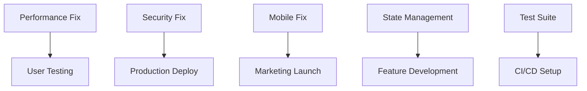

# FlowBotz Agent Coordination Plan

## Agent Team Roster

### 1. Frontend Performance Optimizer
**Expertise**: React optimization, bundle size, performance profiling
**Current Priority**: P0 - CRITICAL
**Assigned Tasks**:
- Performance crisis resolution
- State management implementation
- Error handling system

**Immediate Actions**:
```bash
# Start with performance profiling
1. Use React DevTools Profiler
2. Analyze bundle with webpack-bundle-analyzer
3. Identify render bottlenecks
4. Optimize heavy components
```

### 2. UI/UX Design Architect
**Expertise**: Design systems, responsive design, accessibility
**Current Priority**: P0 - CRITICAL
**Assigned Tasks**:
- Mobile experience fix
- Glassmorphism consistency
- Loading states implementation
- Onboarding flow design

**Immediate Actions**:
```bash
# Fix mobile Creator Studio
1. Audit all breakpoints
2. Create mobile-specific layouts
3. Implement touch controls
4. Test on real devices
```

### 3. Backend Security Developer
**Expertise**: API security, authentication, data protection
**Current Priority**: P0 - CRITICAL
**Assigned Tasks**:
- Security vulnerability fixes
- API validation
- WebSocket implementation
- Caching strategy

**Immediate Actions**:
```bash
# Security hardening
1. Add input sanitization
2. Implement rate limiting
3. Configure security headers
4. Fix JWT implementation
```

### 4. Database Schema Architect
**Expertise**: Database design, optimization, migrations
**Current Priority**: P2 - MEDIUM
**Assigned Tasks**:
- Database optimization
- Index creation
- Query optimization
- Migration system

**Immediate Actions**:
```bash
# After critical fixes
1. Analyze slow queries
2. Create proper indexes
3. Optimize relationships
4. Set up migrations
```

### 5. QA Automation Specialist
**Expertise**: Testing frameworks, E2E testing, quality assurance
**Current Priority**: P1 - HIGH
**Assigned Tasks**:
- Test suite repair
- E2E test creation
- Performance benchmarks
- Accessibility testing

**Immediate Actions**:
```bash
# Fix test suite
1. Install missing dependencies
2. Fix test configurations
3. Resolve all failures
4. Set up CI/CD tests
```

### 6. Security Compliance Auditor
**Expertise**: Security standards, compliance, vulnerability assessment
**Current Priority**: P3 - SUPPORT
**Assigned Tasks**:
- Security audit support
- OWASP compliance check
- GDPR/CCPA review
- Penetration testing

**Support Role**:
```bash
# Support security developer
1. Review security implementations
2. Check compliance standards
3. Document vulnerabilities
4. Verify fixes
```

### 7. Codebase Maintenance Optimizer
**Expertise**: Code quality, refactoring, documentation
**Current Priority**: P1 - HIGH
**Assigned Tasks**:
- Component refactoring
- Code organization
- Documentation updates
- Technical debt reduction

**Immediate Actions**:
```bash
# Refactor large components
1. Break down creator/page.tsx
2. Extract reusable components
3. Improve TypeScript types
4. Add documentation
```

## Coordination Protocol

### Daily Sync Points
```yaml
Morning Sync (10 AM EST):
  - Each agent reports progress
  - Identify blockers
  - Adjust priorities
  
Midday Check (2 PM EST):
  - Quick status update
  - Help needed callouts
  - Resource sharing
  
End of Day (6 PM EST):
  - Commit all changes
  - Update workflow_state.md
  - Plan tomorrow's work
```

### Communication Channels
```yaml
Critical Issues: #flowbotz-critical (immediate response)
General Updates: #flowbotz-dev (async updates)
Code Reviews: GitHub PRs (within 2 hours)
Blockers: Direct message + escalation
```

## Task Handoff Protocol

### Handoff Requirements
1. **Code Complete**: All changes committed with clear messages
2. **Tests Written**: Unit tests for new code
3. **Documentation**: README or inline comments updated
4. **Review Ready**: Self-reviewed and tested locally
5. **Context Provided**: Clear handoff notes in PR

### Handoff Template
```markdown
## Handoff: [Feature/Fix Name]
**From**: [Agent Name]
**To**: [Agent Name]
**Status**: [Complete/Partial/Blocked]

### What Was Done
- List of completed items
- Changes made
- Files affected

### What's Left
- Remaining tasks
- Known issues
- Dependencies

### Testing
- How to test
- Expected behavior
- Edge cases

### Notes
- Important context
- Decisions made
- Recommendations
```

## Parallel Work Streams

### Stream 1: Performance & Optimization
**Lead**: frontend-performance-optimizer
**Support**: codebase-maintenance-optimizer
```
Goals:
- 60fps animations
- <1MB bundle size
- <2s load time
- 95+ Lighthouse score
```

### Stream 2: User Experience
**Lead**: ui-ux-design-architect
**Support**: frontend-performance-optimizer
```
Goals:
- Mobile responsive
- Consistent design system
- Smooth interactions
- Intuitive workflows
```

### Stream 3: Backend & Security
**Lead**: backend-security-developer
**Support**: security-compliance-auditor
```
Goals:
- Secure APIs
- Fast responses
- Reliable services
- Scalable architecture
```

### Stream 4: Quality & Testing
**Lead**: qa-automation-specialist
**Support**: All agents
```
Goals:
- 90% test coverage
- E2E test suite
- Performance benchmarks
- Quality gates
```

## Dependency Management

### Critical Dependencies


### Blocking Resolution
1. **Identify**: Flag in daily sync
2. **Escalate**: To project orchestrator
3. **Pair**: Two agents collaborate
4. **Unblock**: Remove dependency
5. **Continue**: Resume normal flow

## Quality Gates

### Code Review Checklist
- [ ] Follows project standards
- [ ] Max 500 lines per file
- [ ] Max 50 lines per function
- [ ] TypeScript types complete
- [ ] Tests included
- [ ] Documentation updated
- [ ] Performance impact assessed
- [ ] Security reviewed
- [ ] Mobile tested
- [ ] Accessibility checked

### Merge Criteria
- All CI checks passing
- 2 approving reviews
- No merge conflicts
- Test coverage maintained
- Performance benchmarks met

## Escalation Matrix

### Severity Levels
```yaml
P0 - CRITICAL:
  Response: Immediate
  Escalation: All hands
  Resolution: Same day
  
P1 - HIGH:
  Response: Within 2 hours
  Escalation: Team lead
  Resolution: Within 24 hours
  
P2 - MEDIUM:
  Response: Within 4 hours
  Escalation: Normal process
  Resolution: Within sprint
  
P3 - LOW:
  Response: Next day
  Escalation: As needed
  Resolution: Next sprint
```

## Success Metrics

### Individual Agent Metrics
```yaml
Frontend Performance Optimizer:
  - Performance score improvement
  - Bundle size reduction
  - Render optimization count
  
UI/UX Design Architect:
  - Design consistency score
  - Mobile usability fixes
  - Component reusability
  
Backend Security Developer:
  - Vulnerabilities fixed
  - API response time
  - Security test coverage
  
Database Schema Architect:
  - Query performance improvement
  - Index effectiveness
  - Migration success rate
  
QA Automation Specialist:
  - Test coverage increase
  - Bug detection rate
  - Test execution time
  
Security Compliance Auditor:
  - Compliance score
  - Vulnerabilities identified
  - Audit completeness
  
Codebase Maintenance Optimizer:
  - Code quality score
  - Technical debt reduction
  - Documentation coverage
```

### Team Metrics
- Sprint velocity
- Deployment frequency
- Mean time to recovery
- Change failure rate
- Team satisfaction

## Resource Sharing

### Shared Resources
```yaml
Design System:
  Location: /components/glassmorphism
  Owner: ui-ux-design-architect
  
API Documentation:
  Location: /docs/api
  Owner: backend-security-developer
  
Test Utilities:
  Location: /tests/utils
  Owner: qa-automation-specialist
  
Performance Tools:
  Location: /tools/performance
  Owner: frontend-performance-optimizer
```

## Continuous Improvement

### Weekly Retrospective
- What went well?
- What could improve?
- Action items
- Process adjustments

### Knowledge Sharing
- Document learnings
- Share best practices
- Create reusable solutions
- Update team playbook

## Emergency Response

### Production Issue Protocol
1. **Alert**: Page all critical agents
2. **Assess**: Determine severity and impact
3. **Triage**: Assign response team
4. **Fix**: Implement immediate solution
5. **Review**: Post-mortem analysis

### Rollback Procedure
1. Identify breaking change
2. Revert to last known good
3. Communicate status
4. Fix forward
5. Deploy corrected version

## Agent Availability

### Coverage Schedule
```yaml
Primary Hours: 9 AM - 6 PM EST
On-Call Rotation: 24/7 coverage
Response Time: 
  - Critical: 15 minutes
  - High: 2 hours
  - Medium: 4 hours
  - Low: Next business day
```

## Final Notes

- Agents should check project-vault daily
- Update workflow_state.md after major changes
- Communicate early and often
- Ask for help when needed
- Celebrate wins together